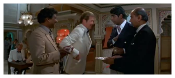
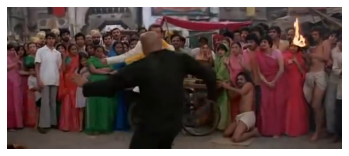

## OpenCV Image and Video Processing
- Learn how to use OpenCV to read and edit images
- Learn how to download videos from Youtube and read frames using OpenCV

## Libraries

- _cv2_ OpenCV for image and video processing
- _matplotlib_ for image display
- _youtube-dl_ to download youtube videos


## Import Python Modules


```python
import cv2
import matplotlib.pyplot as plt
```

## Read Image and get shape


```python
image = cv2.imread("Naxos_Taverna.jpg", cv2.IMREAD_COLOR)
width,height,channels = image.shape
```

## Convert Image Color


```python
image = cv2.cvtColor(image, cv2.COLOR_BGR2RGB)
```


```python
#plt.imshow(image,extent=[width,height,0,1],aspect="auto")
plt.imshow(image,extent=[width,height,0,1],aspect="auto")
plt.grid(False)
plt.axis('off')
plt.show()
```


## Play and Download videos from youtube in mp4 format

Example: https://www.youtube.com/watch?v=Zbl3n2qQ-iQ

```
from IPython.lib.display import YouTubeVideo
YouTubeVideo('Zbl3n2qQ-iQ')
```

### Download

`youtube-dl -o '%(title)s.%(ext)s' Zbl3n2qQ-iQ --restrict-filenames -f mp4`


```python
from IPython.lib.display import YouTubeVideo
YouTubeVideo('Y9w0cVVmJsk')
```


<iframe
    width="400"
    height="300"
    src="https://www.youtube.com/embed/Y9w0cVVmJsk"
    frameborder="0"
    allowfullscreen
></iframe>


### Display Video Metadata


```python
!youtube-dl -o '%(title)s.%(ext)s' Y9w0cVVmJsk --restrict-filenames -f mp4
```

    [youtube] Y9w0cVVmJsk: Downloading webpage
    [download] Destination: HGTV_Dream_Home_2020_-_Designing_for_an_Open-Concept_Space.mp4
    [download] 100% of 77.43MiB in 00:0380MiB/s ETA 00:00209
    

## Get Video Metadata


```python
#cap = cv2.VideoCapture('HGTV_Dream_Home_2020_-_Designing_for_an_Open-Concept_Space.mp4')
cap = cv2.VideoCapture('JAMES_BOND_IN_ACTION_007_IN_INDIA.mp4')
height = int(cap.get(cv2.CAP_PROP_FRAME_HEIGHT))
width = int(cap.get(cv2.CAP_PROP_FRAME_WIDTH))
total_frames = int(cap.get(cv2.CAP_PROP_FRAME_COUNT))
fps = cap.get(cv2.CAP_PROP_FPS)

print("Width x Height = %d x %d, Frames = %d, Frames/second = %d\n"%(width,height,total_frames,fps))
```

    Width x Height = 640 x 272, Frames = 5887, Frames/second = 25
    
    


```python
#cap = cv2.VideoCapture('HGTV_Dream_Home_2020_-_Designing_for_an_Open-Concept_Space.mp4')
cap = cv2.VideoCapture('JAMES_BOND_IN_ACTION_007_IN_INDIA.mp4')
for i in range(1,total_frames,5000):
for i in range(1,total_frames,2000):
    cap.set(cv2.CAP_PROP_POS_FRAMES,i)
    ret,frame = cap.read()
    frame = cv2.cvtColor(frame, cv2.COLOR_BGR2RGB)
    plt.imshow(frame)
    plt.grid(False)
    plt.axis('off')
    plt.show()
```








```python

```
